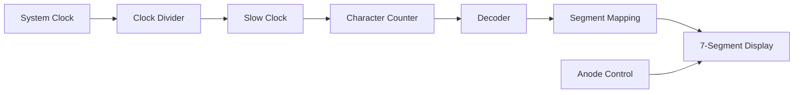

# 🚀 FPGA "HELLO WORLD" on 7-Segment Display

> A hardware-level implementation of **"HELLO WORLD"** using Verilog on FPGA with a 7-segment display.

---

## 📌 Overview

This project demonstrates a complete FPGA-based design to display **"HELLO WORLD"** sequentially on a 7-segment display.
It covers core digital design concepts such as **clock division, combinational decoding, and hardware interfacing**.

---

## 🎯 Key Features

✨ Pure Verilog implementation (no IP cores)
✨ Displays characters sequentially on 7-segment
✨ Designed for RealDigital Boolean Board
✨ Includes simulation + hardware validation
✨ Handles active LOW logic and display control

---

## 🧠 Design Architecture



---

## ⚙️ How It Works

* ⏱ **Clock Divider** slows FPGA clock for visibility
* 🔢 **Counter** cycles through "HELLO WORLD"
* 🔤 **Decoder** maps characters → 7-segment patterns
* 💡 **Anode Control** enables one digit at a time
* 🔌 **Segment Mapping** aligns logic with hardware

---

## 🛠️ Tools & Technologies

* Verilog HDL
* Xilinx Vivado
* FPGA (RealDigital Boolean Board)

---

## 📂 Project Structure

```
src/           → Verilog design
sim/           → Testbench
constraints/   → XDC file
docs/          → Output images
```

---

## 📷 Hardware Output


<p align="center">
  
  
</p>

---

## ⚠️ Important Notes

* 7-segment display is **Common Anode**
* Signals are **Active LOW**
* Segment mapping is **board-specific**
* Some letters are approximated (7-seg limitation)

---

## 🚀 Getting Started

1. Open project in Vivado
2. Add source + constraints
3. Run Synthesis → Implementation
4. Generate Bitstream
5. Program FPGA

---

## 🧪 Simulation

* Testbench included
* Verifies character sequencing and timing

---

## 📚 Key Learnings

* FPGA hardware debugging vs simulation
* Importance of pin mapping and signal polarity
* Real-world constraints in digital design

---

## 🔮 Future Improvements

* 🔁 Multi-digit scrolling display
* 🎛 Speed control via switches
* 📡 UART-based dynamic text input
* 🧠 Integration with SoC/ASIC design

---

## 👩‍💻 Author

**Nandini Kendre**
Senior Research Fellow | FPGA & ASIC Design

---

## ⭐ If you like this project

Give it a ⭐ on GitHub and feel free to contribute!
